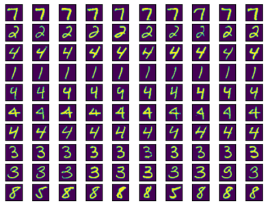
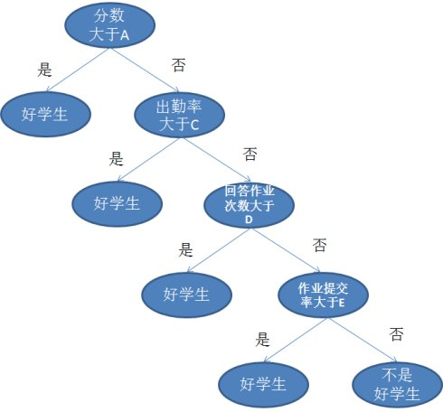

### AIπ团队2020秋季招新 第一轮测试 试题

​	欢迎各位同学参加AIπ团队2020年秋招，这是第一轮测试的试题。本轮测试共有5道题目，出题时考虑到不同年级的平均水平参差不齐，本轮测试选取基本的机器学习模型进行考察。这一份题目对低年级的同学可能有一定的难度，如感觉困难较大，可以选择完成几个大题，或完成大题中的部分小题；希望你发扬不畏艰险的精神，根据给出的参考信息和你自行检索到的文献资料进行学习和思考，相信你也会收获不少。

​	**\*\*\*重要\*\*\***：题目提交时，请进行打包，打包后的文件名称为：AIπ2020Fall-Round1-U20xxxxxxx-姓名.***FileSuffix***

​	请你按照下列格式对解题结果进行打包，包内目录结构为：

```
--AIπ2020Fall-Round1-U20xxxxxxx-姓名  	//根目录，命名方式已给出
	--KNN								//KNN算法
	--Naive_Bayes						//朴素贝叶斯
	--Decision_Tree						//决策树
	--FC								//全连接神经网络
	--Titanic							//Titanic生存预测综合题
```

​	请按照各个题目的要求，在相应目录内存放可能需要的代码、结果、推导、文档材料等你认为需要上交的内容。如果没有解题，可以不创建相应的文件夹。在不影响理解的情况下，尽量不要将题目本身的文件放入包中，如题目3中的两份参考文献，但为了程序可以运行，可以包含数据集。**希望你在代码中写出必要的注释。**

​	***提交截止时间为：2020年10月15日 23:59:59 中国标准时间(CST)**

​	***提交方式：将你的解题结果打包，通过电子邮件发送至：hust_aipai@163.com**

​	欢迎大家参加我们组织的“**测试半程交流会**”，预计地点在启明学院亮胜楼，时间在2020年10月11日，由于这一行程尚未确定，请以群内通知为准。

​	没有规矩，不成方圆。学术诚信是进行一切学术活动的基本准则。我们给出了充分的学习材料和开放的答题环境，允许大家在思路和细节上进行一定的交流。但我们同时希望你恪守诚信准则，不剽窃他人的代码。**我们将根据情况对代码进行审查**，若发现高度雷同并经核实，将取消相应同学的招新资格。

​	下面是题目信息，请仔细阅读，尽力而为！


#### 题目1 KNN算法

​	俗话说“近朱者赤，近墨者黑”，这句话说明了一个假设，即相似的人和事物，往往归于相同或相似的类别；在分类任务中，这种思想大量适用。试想，将一个待分类的数据想象为空间中的一个点，基于前面的假设，我们找到离该点最近的几个已知类别的点，即可对这个待分类数据进行分类预测。例如，一个点最近的3个已知点的类别分别为$\{a, b, b\}$，那么我们可以合理预测这个待分类点的类别也为$b$.

​	K-NN (K - Nearest Neighbors) 算法，中文译作K近邻算法，是一种基于“距离”进行分类的算法。这一算法通过寻找距离待分类点最近的k个已知点，来对该点进行分类预测。上述例子中取3个点的操作，便是指定$k = 3$. 这里我们提出“超参数”这一概念，即在一个机器学习模型中，没有学得，而是由用户或训练者自行指定的参数。这里的$k$便是一个超参数，用于指示参与最终判断的，最近点的个数。

​	***本题要求：请你学习并实现KNN算法，并使用其对MNIST数据集进行分类。**

​	下面介绍MNIST数据集：

- MNIST数据集是十分常用的图像分类数据集之一，其内容为由0到9的**手写数字**，共10个类别；

- 训练集含有60,000个样本，测试集含有10,000个样本。

- 每个样本是28*28的二维图像，图像的内容是手写的数字。

- 本数据集基本无需清洗，可以直接使用。

    一些样本示例：



**具体要求：**

- 学习如何读取、导入、处理MNIST数据集；
- 使用基本Python语法和NumPy等数学运算库实现KNN算法；
- 简要分析你的算法性能，并从KNN的原理出发，思考不同的$k$对性能有何影响；在该任务中，比较合适的$k$是什么？
- KNN中可以使用多种距离度量，比较常见的是欧几里得距离，即点在空间中的直线距离，请问是否有其他形式的距离度量？效果如何？
- 图像实质上是一种高维信息，将图像的每一个像素点看成一个维度，那么MNIST数据集的图像是一个784维的数据，是一个高维数据。而当数据维度过高时，容易导致”维度灾难“ (Curse of Dimensionality)。请你了解这一概念，尝试用数学语言说明“维度灾难”是如何导致的；同时，784维是一个很高的维度，反常的是，KNN仍然能在MNIST上取得很好的分类效果，请思考其原因；
- 根据你的实际感受，你认为KNN算法运行速度如何；尝试加快你的代码运行。


**供你参考：**

- 周志华.机器学习[M].北京:清华大学出版社,2016:425
- KNN - Cornell CS4780 Lecture Notes: http://www.cs.cornell.edu/courses/cs4780/2018fa/lectures/lecturenote02_kNN.html
- MNIST数据集: http://yann.lecun.com/exdb/mnist/
- 利用TensorFlow在线导入MNIST数据集：https://blog.csdn.net/wangsiji_buaa/article/details/80332724
- Python下由文件读取MNIST数据集：https://www.jianshu.com/p/e7c286530ab9


**一些提示：**

- NumPy的矩阵计算会显著快于循环处理；
- 思考或查阅对图像信息的一些研究；
- 程序运行的加速思想有很多，如“空间换时间”、“并行计算”等；NumPy矩阵运算快速的原因是，其底层代码对矩阵运算进行了算法和并行上的优化。尝试将加速思想用在你的计算中；
- 一开始编写模型时，建议不要采用完整的数据集进行计算，这样可能导致计算时间过长，降低编写效率；建议先使用一些办法将数据集规模缩减，验证模型正确性后，再探索模型的性质。


#### 题目2 朴素贝叶斯分类器

​	设有数据$\mathbf x$，在分类任务中，假设其真实类别为$y$，我们希望某个模型可以根据$x$得到其类别的预测$h(\mathbf{x})$，并尽可能使得$h(\mathbf{x}) = y$；因此从概率的角度描述，这一问题可以描述为：
$$
h(\mathbf{x}) = \operatorname*{argmax}_{y} P(y | \mathbf x)
$$
​	即给出“尽可能”符合实际情况的预测。

​	为了实现这样的目的，有一类机器学习模型叫做生成模型。根据贝叶斯法则，有：
$$
P(y|\mathbf x) = \frac{P(\mathbf x|y)P(y)}{P(\mathbf x)}
$$
​	在给定数据集的前提下，$P(\mathbb x)$是常数，模型学习的是$P(\mathbb x|y)$，即给定一个标签下，出现某种数据特征的概率。“生成”二字便体现于此，这一条件概率说明，在给定标签的前提下，模型可以给出特征，或至少预测什么样的特征最可能出现。

​	朴素贝叶斯分类器是一种经典的统计学习模型，有明显的生成学习特征。该模型在解决垃圾邮件分类问题上有非常好的效果。在这一模型中，预测任务描述为：
$$
\begin{align}
h(\mathbf{x}) &= \operatorname*{argmax}_y P(y | \mathbf{x}) \\
&= \operatorname*{argmax}_y \; \frac{P(\mathbf{x} | y)P(y)}{P(\mathbf{x})} \\
&= \operatorname*{argmax}_y \; P(\mathbf{x} | y) P(y) &&  \\
&= \operatorname*{argmax}_y \; \prod_{\alpha=1}^{d} P(x_\alpha | y) P(y) && \\
&= \operatorname*{argmax}_y \; \sum_{\alpha = 1}^{d} \log(P(x_\alpha | y)) + \log(P(y)) && 
\end{align}
$$
​	最终根据数据特征的类型，选取恰当的，用于衡量$P(x_\alpha | y)$的策略，即可完成对数据的分类预测。

​	***本题要求：请你实现朴素贝叶斯分类器，在给定的数据集“[enron.zip](Naive_Bayes\enron.zip)”上完成英文垃圾邮件分类任务，并评估模型性能。**

​	下面介绍本题中用到的数据集，The Enron Email Dataset：

- 这一数据集中包含了Enron公司的邮件数据，目录结构为：

```
--data					//主目录

	--train				//训练集

		--ham			//正常邮件，共13236个样本

		--spam			//垃圾邮件，共13726个样本

	--test				//测试集

		--ham			//正常邮件，共3309个样本

		--spam			//垃圾邮件，共3431个样本
```

- 数据集本身是5个分立的文件包，原本有大量文件重复；为了降低难度，我们去除了重复，但去重后数据量如上所示，并不规整，但两类标签的数据量大致相同，即正常邮件：垃圾邮件 ≈ 1:1；
- 上述测试集和训练集的分割是在去重后进行的，方法是随机选取，且训练集：测试集 ≈ 5:1；
- 邮件内容中基本没有乱码字符，较为规整。


**具体要求：**

- 朴素贝叶斯分类器在不同的假设下有不同的形式，请你了解并自行评估各种假设有何特点。（参考下面给出的Cornell CS4780 Lecture Notes）

- 选择一种恰当的假设，推导其表达式并解释选择的原因。建议推导使用LaTeX书写，如若未习得，也可使用其他形式；

- 代码实现，能正确读入邮件数据，恰当使用停用词表，模型能正确运行；
- 能够较为准确地分类垃圾邮件（spam）和非垃圾邮件（ham），准确率达到85%，未能达到的请思考可能的原因。


**供你参考：**

- 周志华.机器学习[M].北京:清华大学出版社,2016:425
- Bayes Classifier and Naive Bayes - Cornell CS4780 Lecture Notes: http://www.cs.cornell.edu/courses/cs4780/2018fa/lectures/lecturenote05.html
- Python标准库文档：https://docs.python.org/zh-cn/3/library/
- 停用词 - 百度百科：https://baike.baidu.com/item/%E5%81%9C%E7%94%A8%E8%AF%8D/4531676?fr=aladdin


**一些提示：**

- 恰当使用停词表可以提高模型性能，不过前提是模型得到了正确实现；
- 由于数据集中，文件名是不规整的，需要你自行调用Python的标准库，对目录文件建立索引，再根据索引进行读取；参考链接已给出；
- 同KNN算法，当模型的正确性尚未保证时，尝试限制参与计算的数据集大小，避免计算速度过慢影响编写效率；


#### 题目3 决策树

​	在分类任务中，如果数据的特征有限（维度不高），决策树是一种好用的机器学习模型。为直观起见，用下图来说明问题背景：



​	这一图中使用了几个特征来判断一个学生是否为好学生。在给定{分数，出勤率，回答作业次数，作业提交率}的情况下，我们可以根据上述树状结构得出判断。显然学得这一决策树的数据集中，不是好学生的学生同时满足{分数<=A，出勤率<=C， 回答作业次数<=D， 作业提交率<=E}四个条件。形如图上这种，按照一定顺序，给数据的特征划定界限对数据进行分类的方法，称为决策树。

​	显然，决策树选取特征是有顺序性的，如上图中，首先做判断的是分数，即分数有最高的优先级。

​	***本题要求：请你学习决策树的相关知识，在所给的Iris鸢尾花数据集上实现决策树的生成，并对该数据集进行分类。**

​	下面介绍Iris鸢尾花数据集：

- **Iris鸢尾花数据集**是一个经典数据集，在统计学习和机器学习领域都经常被用作示例；
- 数据集内包含 3 类共 150 条记录；每类各 50 个数据；
- 每条记录都有 4 项特征：花萼长度[sepal length (cm)]、花萼宽度[sepal width (cm)]、花瓣长度[petal length (cm)]、花瓣宽度[petal width (cm)];
- 鸢尾花的类别共三种，标记为0[setosa], 1[versicolour], 2[virginica].


**具体要求：**

- 用**决策树**算法在**鸢尾花数据集**上训练，并自行划分一定测试集进行测试；数据集文件已给出，为"[iris.csv](Decision_Tree\iris.csv)"； 
- 尝试对决策树进行**剪枝**，提升测试准确率；
- 用集成学习的**随机森林**算法，提升决策树的测试准确率。
- 对上述模型的参数进行调节，观察输出，尝试分析原因。


***注：本题严禁直接调用已经封装好的各类机器学习库（包括但不限于sklearn），但可以用NumPy等数学运算库.**

**供你参考：**

- [机器学习\_决策树\_随机森林.pdf](Decision_Tree\机器学习_决策树_随机森林.pdf) 
- [统计学习方法_决策树.pdf](Decision_Tree\统计学习方法_决策树.pdf) 
- Decision Trees - Cornell CS4780 Lecture Notes: http://www.cs.cornell.edu/courses/cs4780/2018fa/lectures/lecturenote17.html

**一些提示：**

- 如果写**连续属性的决策树**较为困难，也可以将参数分类成不同类别，然后用**离散属性的决策树**处理；
- 本题要求逐级递增，可以选择性完成。


#### 题目4 神经网络

​	神经网络是时下深度学习技术的基础，本题目旨在考察同学们对神经网络基本原理的掌握程度；

​    不妨以只有一层隐藏层的神经网络为例，隐藏层共有四个神经元。神经网络的**前向传播**过程如下：

- 假设有$m$个输入样例，并且每个输入样例有$n$个输入特征，则$\mathbb x$为$(n * m)$矩阵。
- 由于样例特征有$n$个，则输入层的神经元数量为$n$；
- 对于隐藏层和输出层，会学到一组参数$w$和$b$，对于隐藏层，设学到$w_1$和$b_1$，${w}_{1}$为$(n * 4)$矩阵，作为某个输入$\mathbb x$各项的权值；$b_1$为是一个长为$4$的列向量，作为偏移量。
- 则在进入隐藏层前，根据输入层数据，可以先计算得到$z_1=w_1^T \mathbb x + b_1$，为$(4 * m)$矩阵，再经激活函数作用后得隐藏层输出$y_1=\sigma(z_1)$，作为输出层的输入。
- 随后，输出层根据$y_1$计算得到${z}_{2}={w}_{2}^{T}{y}_{1}+{b}_{2}$，再经激活函数${y}_{2}=\sigma({z}_{2})$，即得最终输出值.

​	对**反向传播**过程而言，其基本思想是通过设计一个损失函数$s$，给出$s$与$w$的关系，通过利用梯度是函数变化最快的方向的先验知识，迭代地更新神经网络的权重系数$w_1$和$w_2$，实现损失函数值的不断减小。

​	***本题要求：尝试自行推导出神经网络的反向传播过程，并实现一个基本的两层全连接神经网络，在MNIST数据集上进行分类任务。**

​	MNIST数据集在KNN一题中已经介绍，此处不再赘述。


**具体要求：**

- 推导反向传播公式，并做文档记录；为了方便起见，这里指定激活函数$\sigma(x)$为$Sigmoid(·)$，其表达式为：


$$
Sigmoid(x) = \frac{1}{1+e^{-x}}
$$

- 代码实现上述两层全连接神经网络，并根据推导的反向传播公式，进行梯度下降优化，使神经网络可以随着训练过程有更好的分类效果。
- 分析性能，如果你完成了KNN算法一题，试分析二者在性能上的差异，具体地说，请分析两种模型的分类效果和计算开销。

***注：本题严禁直接调用已经封装好的各类机器学习库（包括但不限于sklearn），但可以用NumPy等数学运算库.**


**供你参考：**

- Neural Networks - Cornell CS4780 Lecture Notes: http://www.cs.cornell.edu/courses/cs4780/2018fa/lectures/lecturenote20.pdf
- 周志华.机器学习[M].北京:清华大学出版社,2016:425
- 矩阵求导术：https://zhuanlan.zhihu.com/p/24709748


**一些提示：**

- 该过程的推导过程中需要用到多元函数微分的知识，矩阵形式的表达是对该过程的简略书写，可以让推导过程更加简洁明了。我们推荐你使用这样的语言来描述问题，但这也需要一点矩阵微分的知识，我们在上述参考中给出一份有关矩阵微分的参考资料，同学们可以自行查找对应微分公式，尝试给出神经网络反向传播算法流程，并尽可能将其实现。
- $Sigmoid(·)$函数具有优良的求导性质，其导数$Sigmoid'(x)$满足：

$$
Sigmoid'(x) = Sigmoid(x) * (1 - Sigmoid(x))
$$


#### 题目5 Titanic

​	泰坦尼克号的沉没是世界历史上最臭名昭著的沉船事故之一。

​	1919年4月15日，号称“永不沉没”的泰坦尼克号在处女航中撞上冰山后沉没。不幸的是，由于船上救生艇的不足，此次事故共计2224名乘客和1502名船员遇难。

​	然而，在考察生存情况时，排除掉一些运气因素，我们发现似乎某些群体更有可能存活下来。

​	在本题中，有两个数据集：[test.csv](Titanic\test.csv), [train.csv](Titanic\train.csv)，这两个数据集包含了乘客的一些信息，包括了性别、年龄、生存情况等等。

​	***本题要求：利用train.csv中的数据，选取适当的模型进行学习，完成对test.csv中乘客生存情况的预测。在Kaggle平台上注册并上传，得到预测准确率。**

​	由于test.csv中并没有供你进行测试的标签信息，你需要进行在线上传并由平台对你的成绩进行评分。


**具体要求：**

- 正确读取csv数据，认识、了解数据特性，对数据进行恰当的处理；
- 选择你认为恰当的模型，简述理由；
- 对你选择的模型进行代码实现，并进行性能评估；
- 注册一个Kaggle账号，在**Titanic: Machine Learning from Disaster**竞赛中按照文档要求上传你的预测结果，并留存最好的成绩。

***注：本题严禁直接调用已经封装好的各类机器学习库（包括但不限于sklearn），但可以用NumPy等数学运算库.**


**供你参考：**

- 周志华.机器学习[M].北京:清华大学出版社,2016:425
- Titanic: Machine Learning from Disaster - Kaggle: https://www.kaggle.com/c/titanic/overview


**一些提示：**

- 题目中给出的数据集有一些缺失项，解题前你需要对数据进行一定程度的处理；
- 如有时间，可以参考、比对多个模型的效果，分析原因。


**祝测试顺利！**

**2020年10月8日**

**AIπ团队**